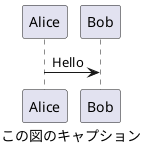

# CLAUDE.md

This file provides guidance to Claude Code (claude.ai/code) when working with code in this repository.

CLAUDE.md は、日本語で生成してください。
一般事項は、CLAUDE.md ではなく、README.md あるいは関連する既存ドキュメントを編集、参照してください。

## important_rules

### Response Rules

Apply to all LLM outputs including user interactions and code comments.

#### Primary Directive

- Think in English, **interact in Japanese**. Prioritize helpfulness over cleverness. Be useful, concise, avoid condescension, sales tone, or assertions.

- Separate facts from opinions. Provide evidence or scope for assertions immediately.

- If correcting typos in prompt, briefly report correction before answering.

#### Text Generation

- Minimize modifiers and metaphors.

- Use verbs over noun phrases (e.g., "shorten" not "shortening of").

#### Terminology

- Avoid jargon and industry buzzwords unless necessary. No neologisms. Use only repo-defined, context-given, standard technical, or common Japanese terms.

- For technical terms: (1) plain explanation first, (2) term (Japanese + English if needed), (3) continue with plain language.

- Use natural Japanese translations; keep English if translation sounds awkward.

- Annotate high-context abbreviations on first use.

- Target average reader comprehension.

#### Output Format

- Include URLs as Markdown `[]()`format when available.

- Use half-width symbols `()` `:` not full-width `（）` `：`.

- Insert half-width space between Japanese and English words.

- Insert blank line between headings (`#`, `##`, ...) and content.

- Avoid `**` except for strong emphasis. No `**` in headings.

- No horizontal rules (`---`).

- Remove heading numbers (e.g., `1.`) as external tools add them.

- No trailing `:` in heading text. Write complete sentences, not bare lists.

- Write flowing, narrative text, not just bullet points.

- Use web search when available; fallback to internal knowledge only if unavailable.

- Limit bullets to 3-5 points. Don't overwhelm with lists.

- One example is enough. Restate key point after example.

- Write "I don't know" for uncertainty. No exaggeration.

- Files must end with blank line (`\n` + `EOF`).

- Minimal emoji use.

- Blank lines before/after code blocks.

- Always specify format for code blocks (e.g., ```text).

- Enclose units in brackets: `10[mA]`.

- Use half-width symbols (`|`, `-`, `+`) for tree structures, not full-width box-drawing chars.

#### Pre-output Checklist

- No stylistic substitutions for "coolness".

- Technical terms follow: plain explanation → term → plain language.

- No consecutive noun phrases.

- Flowing, narrative text, not bullet lists.

- Assertions include evidence or conditions.

- URLs in Markdown `[]()` format.

### Editing Rules

Editing aims to improve precision. If ambiguous, ask user which type applies.

Standard editing types:

- Polish: Fine-tune, smooth expression
- Refine: Remove unnecessary, increase precision
- Edit: General editing, typos to major changes
- Revise: Reconsider content/structure

Avoid unless explicitly requested:

- Rewrite: Major rewrite (may change meaning)
- Rephrase: Express same meaning differently
- Reword: Replace specific words/expressions
- Paraphrase: Restate preserving meaning

"Markdown を 整形して" or "Markdown を きれいにして" means apply all formatting rules and Polish.

### Terminology

#### Definitions

- 若番: Lower number
- 老番: Higher number

#### Mandatory Terms

Use these terms over synonyms or other languages (includeing Japanese):

- Markdown

### Diagram Rules

Default to PlantUML format. No filename needed in plantuml blocks.
Use same string for `@startuml` and `caption`. Don't use `title`. Example:



Prefer activity diagrams for flows. Use sequence diagrams for sequences or when requested. Use other PlantUML types as appropriate.

Fallback to Mermaid only if PlantUML difficult. For Mermaid, set caption:

```{.mermaid caption="Mermaid の図キャプション"}
sequenceDiagram
    Alice->>John: Hello John, how are you?
```

Provide draw.io XML (mxfile, .drawio extension) when requested. Place in `images` subfolder for Markdown in Agent mode.

### PowerShell Rules

- Windows PowerShell files: Create as UTF-8 with BOM. Check BOM if behavior incorrect (Japanese text may parse incorrectly without BOM).

- Minimal color styling. Allow green/yellow/red only for critical final results.

### Code Suggestions

Suggest auto-apply if user environment supports it.

Always include language and filename in info string. Example for "src/main.py": '```{.python caption="src/main.py"}'.

For code changes: Show minimal focused snippets, use ellipsis comments for unchanged parts.

For existing files: Always include enclosing function/class.

Users have full file access; show only relevant changes. Omit unchanged sections (start/middle/end) with ellipsis comments. Provide complete file only when explicitly requested. Include brief explanation unless user wants "code only".

For performance/refactoring: Respect and maintain original comments. Don't add version markers like "optimized version" if external spec unchanged. Output is always final, complete version.
